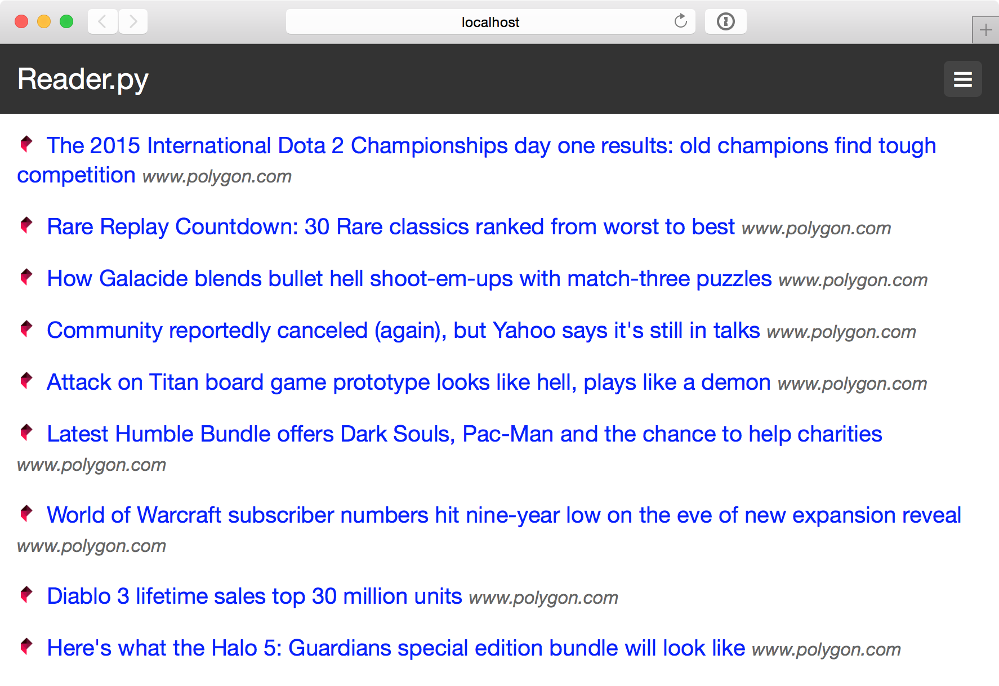

# Reader.py

Reader.py is a simple feed reader built to work on Heroku.

[](https://heroku.com/deploy)

## Installation

Install requirements.

```bash
$ pip install -r requirements.txt
```

Run server.

```bash
$ foreman start
```

## Screenshot


